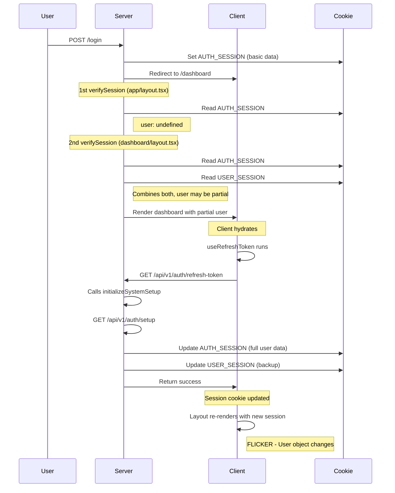

# Session Management Audit Report

## Executive Summary

This audit identifies **critical issues** in the session management system causing:
1. **Screen flickering on login** - Multiple session reads and client-side queries competing
2. **Missing user object** - Race conditions between server/client session updates
3. **Redundant API calls** - useSystemSetup and useRefreshToken making duplicate requests

---

## Problems Identified

### 🔴 CRITICAL: Multiple Session Sources Creating Race Conditions

#### Problem 1: Dual Session Storage System
**Location:** `lib/session.ts`

There are **TWO separate session cookies**:
- `AUTH_SESSION` - Contains accessToken, user_type, mfa_required, user, permissions
- `USER_SESSION` - Backup cookie with user and permissions

**Why this causes issues:**
```typescript
// In updateAuthSession (line 147-202)
const [{ isAuthenticated: isLoggedIn, session: oldSession }, backupUserSession] =
  await Promise.all([verifySession(), getUserSession()]);

const user = (backupUserSession?.user || {}) as User;
const permissions = (backupUserSession?.permissions || []) as Permission[];

const newSession: AuthSession = {
  ...cleanedOldSession,
  ...filteredFields,
  user: filteredFields.user || user,  // ⚠️ Can be undefined if backup fails
  permissions: (filteredFields.permissions || permissions) as Permission[]
};
```

**Result:** User object can be missing from AUTH_SESSION if USER_SESSION hasn't been created yet.

---

#### Problem 2: Client-Side useSystemSetup Hook Running Automatically
**Location:** `hooks/use-users-query-data.ts:35-43`

```typescript
export const useSystemSetup = () =>
  useQuery({
    queryKey: [USERS_QUERY_KEYS.SYS_SETUP],
    queryFn: async () => await initializeSystemSetup({ access_token: "" }),
    retry: 3,
    retryDelay: 3000,
    refetchInterval: 1000 * 60 * 5, // ⚠️ Refetches every 5 minutes
    staleTime: 60 * 1000 * 5
  });
```

**Issues:**
1. **Empty access_token** - Passes empty string instead of reading from session
2. **Auto-refetch** - Runs every 5 minutes, updating session unnecessarily
3. **No enabled flag** - Runs even when not needed
4. **Commented out everywhere** - Not actually being used (see nav-user.tsx:36, user-menu.tsx:20)

**Currently unused but still executing:**
```typescript
// nav-user.tsx (line 36)
// const { data: setup } = useSystemSetup();  // ⚠️ Commented out but hook still imported

// user-menu.tsx (line 20)
// const { data: setup } = useSystemSetup();  // ⚠️ Commented out but hook still imported
```

---

#### Problem 3: useRefreshToken Hook Running Every 3 Minutes
**Location:** `hooks/use-users-query-data.ts:24-34`

```typescript
export const useRefreshToken = (enabled: boolean) =>
  useQuery({
    queryKey: [USERS_QUERY_KEYS.REFRESH_TOKEN, enabled],
    queryFn: getRefreshToken,
    retry: 3,
    retryDelay: 3000,
    refetchOnMount: false,
    refetchInterval: 1000 * 60 * 3, // ⚠️ Refetches every 3 minutes
    staleTime: 60 * 1000 * 3,
    enabled
  });
```

**Used in:** `components/screen-lock.tsx:177`
```typescript
const { data } = useRefreshToken(Boolean(loggedIn && !isIdle));
```

**Issues:**
1. **Calls initializeSystemSetup** - Which fetches user data from `/api/v1/auth/setup`
2. **Updates session cookie** - Every 3 minutes, triggering re-renders
3. **Conflicts with server session** - Server components read old session, client updates it

---

#### Problem 4: Server Components Reading Session 3 Times Per Request
**Locations:**
1. `app/layout.tsx:97` - Root layout reads session for Providers
2. `app/dashboard/layout.tsx:22-23` - Dashboard layout reads session + backup
3. `app/page.tsx:10` - Home page reads session for routing

**Flow on login:**
```
User logs in
  → app/page.tsx reads session (1st read)
  → Redirects to /dashboard/home
  → app/layout.tsx reads session (2nd read)
  → app/dashboard/layout.tsx reads session + backup (3rd + 4th read)
  → Client mounts, useRefreshToken runs (5th API call)
  → Screen flickers as session updates from client-side query
```

---

#### Problem 5: Dashboard Layout Creates Combined Session
**Location:** `app/dashboard/layout.tsx:21-34`

```typescript
const [currentSession, backupUserSession] = await Promise.all([
  verifySession(),     // Read AUTH_SESSION
  getUserSession()     // Read USER_SESSION backup
]);

const { session, isAuthenticated } = currentSession || null;
const { user, permissions } = backupUserSession || {};

const combinedSession = {
  ...session,
  user: { ...user, ...session?.user },  // ⚠️ Merging can create inconsistencies
  permissions: { ...permissions, ...session?.permissions }
};
```

**Problems:**
1. **Two async reads** - Can return different data if session updates between calls
2. **Merge priority unclear** - `{ ...user, ...session?.user }` means session.user overwrites backup, but if session.user is undefined, you get backup.user
3. **No validation** - Doesn't check if user object is complete

---

### 🟡 MODERATE: verifyOTP Now Calls initializeSystemSetup

**Location:** `app/_actions/auth-actions.ts:60-90`

```typescript
export async function verifyOTP({ username, otp }) {
  const response = await axios.post(url, { username, otp });

  // Update session with token
  await updateAuthSession({
    accessToken: session?.access_token,
    mfa_required: false,
    mfa_verified: true
  });

  // ⚠️ NEW: Initialize system setup to fetch user data
  await initializeSystemSetup({ access_token: session?.access_token });

  return successResponse(session, "OTP verified successfully");
}
```

**Issue:** This is correct but adds another layer of complexity. Now verifyOTP:
1. Updates auth session with token
2. Calls initializeSystemSetup which:
   - Fetches from `/api/v1/auth/setup`
   - Calls updateAuthSession again (nested update)
   - Calls createUserSession to save backup

**Result:** Two session cookie updates in rapid succession can cause flicker.

---

## Root Cause Analysis

### Why Screen Flickers



### Why User Object Missing

1. **Login** creates session with NO user object:
   ```typescript
   await createAuthSession({
     accessToken: session?.access_token,
     user_type: session?.user_type,
     // ❌ No user object here
   });
   ```

2. **OTP Verification** now fetches user, but timing matters:
   - If user navigates before setup completes → no user
   - If setup call fails → no user

3. **Dashboard layout** tries to recover with backup:
   - But backup might not exist yet
   - Or might be stale from previous session

---

## Recommended Fixes

### ✅ Solution 1: Remove Dual Cookie System (CRITICAL)

**Change:** Store everything in AUTH_SESSION only, remove USER_SESSION backup.

**Reasoning:**
- Backup system adds complexity without solving the real problem
- If AUTH_SESSION fails, USER_SESSION will also fail (same cookie mechanism)
- Creates race conditions when trying to merge

**Implementation:**
```typescript
// lib/session.ts - Remove createUserSession and getUserSession functions

// auth-actions.ts - Remove all createUserSession calls
export async function initializeSystemSetup() {
  const response = await authenticatedApiClient({ url });
  const session = response?.data;

  // Just update auth session, no backup
  await updateAuthSession({
    user: session?.user,
    permissions: session?.permissions
  });

  return successResponse(session, response?.data?.message);
}
```

---

### ✅ Solution 2: Remove/Disable useSystemSetup Hook (CRITICAL)

**Change:** Delete the hook or disable it by default.

**Reasoning:**
- It's not being used anywhere (commented out in all components)
- Passes empty access_token which is invalid
- Causes unnecessary API calls every 5 minutes
- Server components already handle this

**Implementation:**
```typescript
// Option A: Delete the hook entirely from use-users-query-data.ts

// Option B: Disable by default
export const useSystemSetup = (enabled = false) =>  // ✅ Default disabled
  useQuery({
    queryKey: [USERS_QUERY_KEYS.SYS_SETUP],
    queryFn: async () => await initializeSystemSetup({ access_token: "" }),
    retry: 3,
    retryDelay: 3000,
    refetchInterval: false,  // ✅ Disable auto-refetch
    staleTime: Infinity,     // ✅ Never go stale
    enabled                  // ✅ Only run when explicitly enabled
  });
```

---

### ✅ Solution 3: Optimize useRefreshToken (HIGH PRIORITY)

**Change:** Only run when actually needed, disable auto-refetch.

**Reasoning:**
- Token refresh should be on-demand, not automatic
- Every 3 minutes is too aggressive
- Should only run when token is about to expire or on user action

**Implementation:**
```typescript
export const useRefreshToken = (enabled: boolean) =>
  useQuery({
    queryKey: [USERS_QUERY_KEYS.REFRESH_TOKEN, enabled],
    queryFn: getRefreshToken,
    retry: 1,  // ✅ Reduce retries
    retryDelay: 1000,
    refetchOnMount: false,
    refetchInterval: false,  // ✅ DISABLE auto-refetch
    staleTime: Infinity,     // ✅ Never auto-refetch
    enabled
  });

// Usage in screen-lock.tsx - only refetch on user action
const { refetch } = useRefreshToken(false);  // ✅ Disabled by default

const handleStillHere = async () => {
  await refetch();  // ✅ Manual refetch only
  setState("Active");
  idleTimer.reset();
};
```

---

### ✅ Solution 4: Consolidate Session Reads (MEDIUM PRIORITY)

**Change:** Only read session once in dashboard layout, remove from root layout.

**Current (3 reads):**
```typescript
// app/layout.tsx
const { session } = await verifySession();  // ❌ Read 1

// app/dashboard/layout.tsx
const [currentSession, backupUserSession] = await Promise.all([
  verifySession(),   // ❌ Read 2
  getUserSession()   // ❌ Read 3
]);
```

**Proposed (1 read):**
```typescript
// app/layout.tsx - Remove session read
// Just pass undefined to Providers if not in dashboard

// app/dashboard/layout.tsx - Single source of truth
const { session, isAuthenticated } = await verifySession();

// Pass session directly, no combining
<SiteHeader user={session?.user as User} />
```

---

### ✅ Solution 5: Ensure User Data in Initial Login (HIGH PRIORITY)

**Option A: Fetch user immediately after login**
```typescript
export async function loginUser({ username, password }) {
  const response = await axios.post(url, { username, password });
  const session = response?.data;

  // Create basic session
  await createAuthSession({
    accessToken: session?.access_token,
    user_type: session?.user_type,
    change_password: session?.change_password,
    mfa_required: session?.mfa_required,
    organization_id: session?.organization_id
  });

  // If no MFA required, fetch user data immediately
  if (!session?.mfa_required) {
    await initializeSystemSetup({ access_token: session?.access_token });
  }

  return successResponse(session, session?.message);
}
```

**Option B: Include user in login response (Backend change)**
Ask backend to include user object in login response, so we can save it immediately.

---

### ✅ Solution 6: Simplify Dashboard Layout Session Handling

**Change:** Remove combining logic, trust single session source.

```typescript
export default async function AuthLayout({ children }) {
  const cookieStore = await cookies();
  const defaultOpen = cookieStore.get("sidebar_state")?.value === "true" ||
                      cookieStore.get("sidebar_state") === undefined;

  const { session, isAuthenticated } = await verifySession();

  // ✅ No combining, no backup reads, trust the session
  return (
    <SidebarProvider defaultOpen={defaultOpen}>
      <AppSidebar
        variant="inset"
        session={session}  {/* ✅ Direct pass, no transformation */}
        isAuthenticated={isAuthenticated}
      />
      <SidebarInset>
        <SiteHeader user={session?.user as User} />  {/* ✅ Direct pass */}
        <div className="flex flex-1 flex-col">
          <div className="@container/main">
            {children}
          </div>
        </div>
      </SidebarInset>
    </SidebarProvider>
  );
}
```

---

## Implementation Priority

### Phase 1: Stop the Bleeding (Immediate)
1. ✅ **Disable useSystemSetup auto-refetch** - Prevents 5-minute flickers
2. ✅ **Disable useRefreshToken auto-refetch** - Prevents 3-minute flickers
3. ✅ **Remove combined session logic** - Simplify dashboard layout

**Expected Impact:** Eliminates flickering during active use

---

### Phase 2: Fix Root Cause (Next Sprint)
4. ✅ **Remove USER_SESSION backup cookie** - Eliminates race conditions
5. ✅ **Fetch user data on login (no MFA)** - Ensures user always present
6. ✅ **Remove session read from root layout** - Reduces redundant reads

**Expected Impact:** User object always present, no more skeleton loading

---

### Phase 3: Optimization (Future)
7. ✅ **Token refresh on-demand only** - Better performance
8. ✅ **Delete unused useSystemSetup hook** - Code cleanup
9. ✅ **Add session validation** - Ensure user object completeness

**Expected Impact:** Cleaner codebase, better performance

---

## Testing Checklist

After implementing fixes:

- [ ] Login without MFA → User object immediately available
- [ ] Login with MFA → User object available after OTP verification
- [ ] No screen flicker on initial login
- [ ] User menu shows name immediately (no skeleton)
- [ ] Sidebar user shows name immediately
- [ ] Idle timer works without causing flickers
- [ ] Token refresh only happens on user action (unlock screen)
- [ ] Session persists across page refreshes
- [ ] Logout clears all session data
- [ ] No console errors about missing user object

---

## Current vs. Proposed Flow

### Current Flow (Broken)
```
Login → Create AUTH_SESSION (no user)
  → Redirect to /dashboard
  → Read AUTH_SESSION (user: undefined)
  → Read USER_SESSION (empty, first login)
  → Combine (user: still undefined)
  → Render skeleton
  → useRefreshToken runs
  → Fetch /auth/setup
  → Update AUTH_SESSION (user: {...})
  → Update USER_SESSION (user: {...})
  → Cookies updated
  → Layout re-renders
  → FLICKER - user appears
```

### Proposed Flow (Fixed)
```
Login → Create AUTH_SESSION (no user)
  → Fetch /auth/setup immediately
  → Update AUTH_SESSION (user: {...})
  → Redirect to /dashboard
  → Read AUTH_SESSION (user: {...} ✅)
  → Render with user data (no skeleton)
  → No client-side refetch
  → No flicker
```

---

## Code Files to Modify

1. ✅ `hooks/use-users-query-data.ts` - Disable auto-refetch
2. ✅ `app/_actions/auth-actions.ts` - Add user fetch to login
3. ✅ `app/dashboard/layout.tsx` - Remove combining logic
4. ✅ `lib/session.ts` - Remove USER_SESSION backup (optional)
5. ✅ `components/screen-lock.tsx` - Manual refetch only
6. ✅ `app/layout.tsx` - Remove session read (optional)

---

## Conclusion

The flickering and missing user issues stem from:
1. **Over-engineering** - Dual cookie system adds no value
2. **Auto-refetching** - Client-side queries updating session every few minutes
3. **Race conditions** - Multiple async reads of different cookie sources
4. **Delayed user fetch** - User data not fetched until after first render

The fixes are straightforward but require careful sequencing to avoid breaking existing functionality. Start with disabling auto-refetch (minimal risk), then progressively simplify the session management system.
